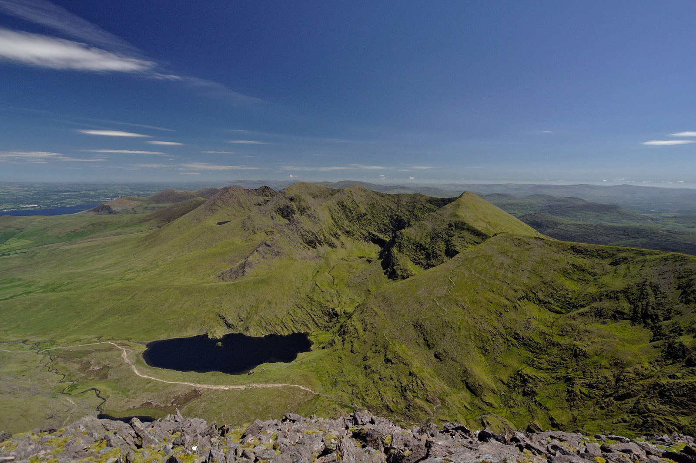

# Rustic Ramblers 
Full stack project for a Points of interest assignment

## Introduction

This project aims to create a website where the Points of interest are Treks and trails which are categorised in to Mountains, Hill, Woodland/Parkland & Greenways.
Within each category there will be a define list of known spots and the user can add treks that do not exist on the site.
The site is called Rustice Ramblers

Render URL: https://rustic-ramblers-poi.onrender.com/

The web application is built on hapi framewokr in node.js and utlises Swagger Open API and JWT authentications.
The db is hosted int he cloud atlas

# Future releases
Future release aims to Manage user roles and defined categoreis with image and map functionality